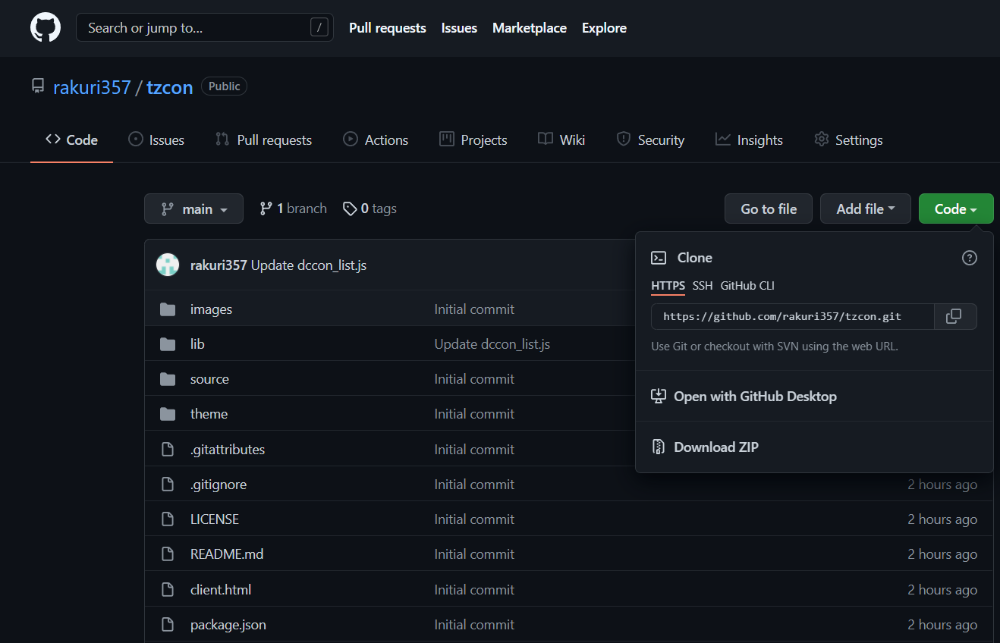
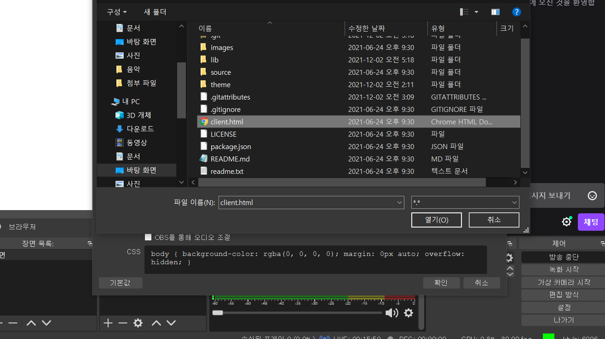
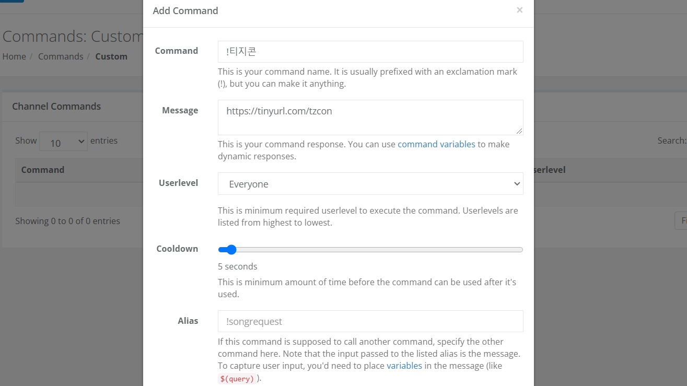
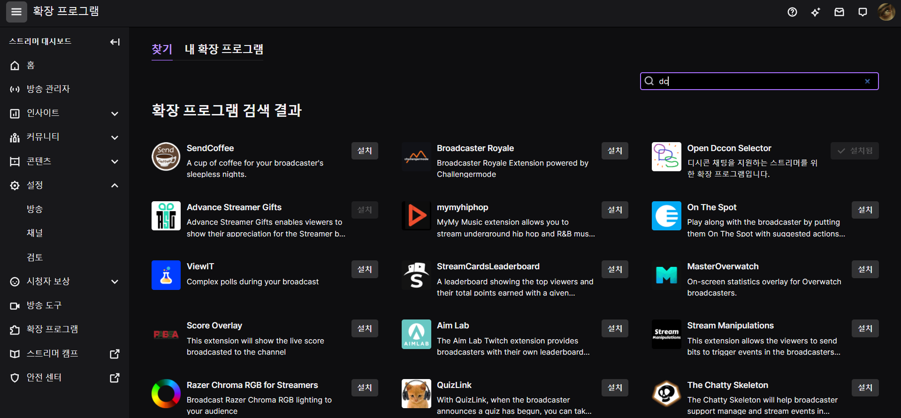
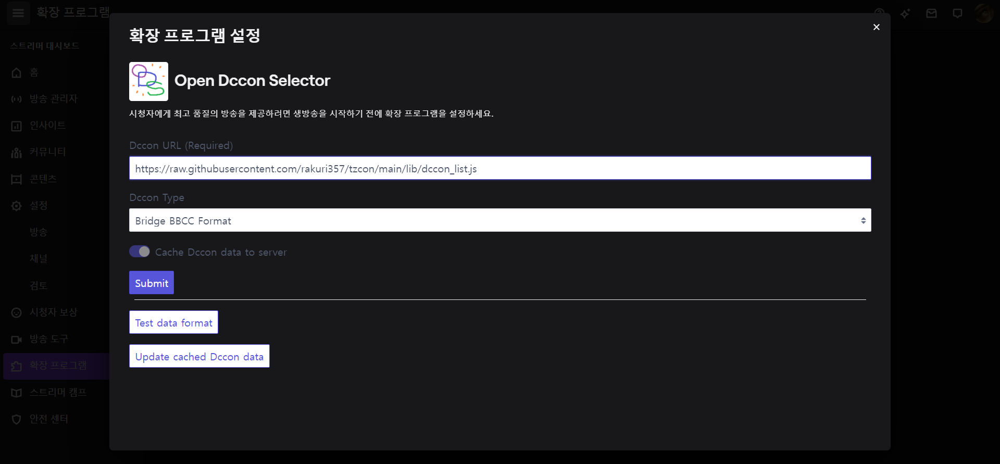
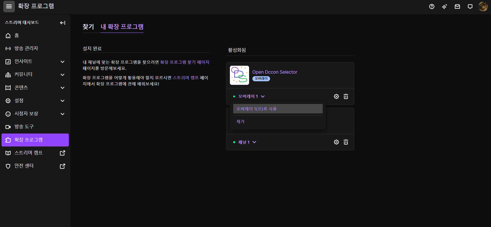

[티지콘 목록](https://rishubil.github.io/jsassist-open-dccon/#/list?dccon_list=https%3A%2F%2Fopen-dccon-selector.update.sh%2Fapi%2Fconvert-dccon-url%3Ftype%3Dbridge_bbcc%26url%3Dhttps%3A%2F%2Fraw.githubusercontent.com%2Frakuri357%2Ftzcon%2Fmain%2Flib%2Fdccon_list.js)  
짧은링크 = https://tinyurl.com/tzcon  

# **티지아가 할 일**  

  
Code - Download ZIP - 압축풀기  

  
송출프로그램 - 브라우저 소스 - 로컬 파일 체크 - client.html 열기  
소스 사이즈는 350x300 추천  
소스 가로길이를 조절해서 디시콘 최대 출력 개수를 변경할 수 있음, 디시콘 크기는 100px  
/theme/default/theme.css 에서 font-size:20px; color: white 변경으로 폰트 사이즈 변경할 수 있음  
원하는 폰트도 추가가능, 텍스트 배경 그림자도 수정 가능  
텍스트 없는 채팅에서 디시콘 중앙정렬하고싶으면 text-align:left을 text-align:center로 수정  
OBS 소스 CSS에서 background-color: rgba(0, 0, 0, 0) 변경으로 소스 뒤 배경 넣을 수 있음, alpha값 0이 최소 1이 최대  
변경사항 즉시 적용하려면 캐시 새로고침  

# **선택사항 (1)**  

  
티지콘 링크 알려주는 싹둑이 명령어 추가하기  

# **선택사항 (2)**  

  
스트리머 대시보드 - 확장 프로그램 - Open Dccon Selector 설치  

  
링크 = https://raw.githubusercontent.com/rakuri357/tzcon/main/lib/dccon_list.js  
포맷 = Bridge BBCC Format 설정 후 Submit  

  
내 확장 프로그램 - 오버레이로 사용